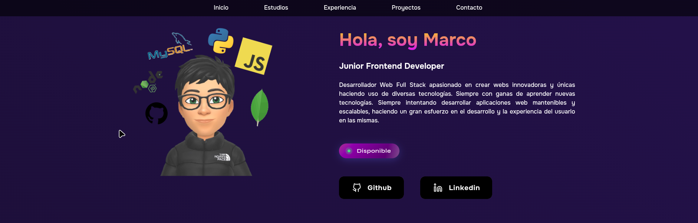

# 🚀 Portfolio personal - Marco

¡Hola! 👋 Soy **Marco**, un desarrollador web **Full Stack Junior** apasionado por crear aplicaciones modernas, funcionales y con buena experiencia de usuario.

Este repositorio contiene mi portfolio personal, donde muestro algunos de mis proyectos, habilidades y formas de trabajar.

---

## 🧑‍💻 Sobre mí

Soy un desarrollador web con enfoque en el desarrollo **full stack**, con interés especial en:

* Construcción de interfaces modernas (Frontend)
* Desarrollo de APIs y lógica de negocio (Backend)
* Buenas prácticas de código y arquitectura
* Aprendizaje continuo 🚀

Actualmente estoy buscando oportunidades para crecer profesionalmente y aportar valor en proyectos reales.

---

## 🛠️ Tecnologías

Estas son algunas de las tecnologías que he aprendido durante mi carrera y con las que trabajo diariamente:

### Frontend

* HTML5, CSS3, Sass
* JavaScript (ES6+) / TypeScript
* React
* Tailwind CSS / Bootstrap

### Backend

* Node.js
* Express
* REST APIs

### Base de datos

* MongoDB
* MySQL

### Herramientas

* Git & GitHub
* Postman
* Vite

---

## 🎯 Objetivo del portfolio

Los principales objetivos de este portfolio son:

* Mostrar mis habilidades técnicas
* Documentar mi progreso como desarrollador web
* Servir como punto de contacto profesional

---

## 📸 Previsualización



---

## ⚙️ Instalación y uso

Si quieres investigar el proyecto de forma local, puedes seguir los siguientes pasos:

```bash
# Clonar el repositorio
git clone https://github.com/tu-usuario/tu-repo.git

# Entrar al directorio
cd tu-repo

# Instalar las dependencias necesarias
npm install

# Ejecutar el proyecto
npm run dev
```

---

## 📈 Estado

🚧 Siempre en constante mejora añadiendo nuevas funcionalidades y proyectos innovadores.
